# NFC IoT Card Reader
## FPB-RA2E3 + PTX105R Quick-Connect PMOD

| | |
|---|---|
| **MCU** | R7FA2E3073CFL — Cortex-M23 · 48 MHz · RA2E3 |
| **NFC IC** | PTX105R — ISO 14443-A/B · NFC-F · ISO 15693 |
| **FSP** | v6.4.0 + FreeRTOS · SDK IoT-Reader v7.2.0 |

> **Renesas Electronics — Confidential**  
> nfc-ptx105r-ra2e3 · FSP v6.4.0 · Rev 1.1 · July 2026

---

## Table of Contents

1. [Overview](#1-overview)
2. [Key Features](#2-key-features)
3. [Dependencies](#3-dependencies)
   - 3.1 [FPB-RA2E3 Fast Prototyping Board](#31-fpb-ra2e3-fast-prototyping-board)
   - 3.2 [PTX105R QC PMOD Board](#32-ptx105r-quick-connect-qc-pmod-board)
   - 3.3 [Pin Connections](#33-pin-connections)
   - 3.4 [USB UART](#34-usb-uart-log-output)
   - 3.5 [Software Requirements](#35-software-requirements)
   - 3.6 [First-Time vs-code Setup](#36-first-time-vs-code-environment-setup)
4. [FSP Configuration](#4-fsp-configuration)
   - 4.1 [BSP Settings](#41-bsp-settings)
   - 4.2 [FSP Stack Overview](#42-fsp-stack-overview)
   - 4.3 [SCI0 SPI & ICU IRQ7 Properties](#43-sci0-spi--icu-irq7-properties)
   - 4.4 [Pin Assignments](#44-pin-assignments)
5. [Demo Bring-Up](#5-demo-bring-up)
6. [Usage](#6-usage)
   - 6.1 [UART Terminal](#61-uart-terminal)
   - 6.2 [LED Feedback](#62-led-feedback)
7. [Data Flow Architecture](#7-data-flow-architecture)
   - 7.1 [Project Structure](#71-project-structure)
   - 7.2 [Software-Layer Architecture](#72-software-layer-architecture)
   - 7.3 [FreeRTOS Task Map](#73-freertos-task-map)
   - 7.4 [PES Configuration](#74-pes-configuration)
   - 7.5 [PES Functions](#75-pes-functions)
8. [Callback Behavior](#8-callback-behavior)
   - 8.1 [Runtime Flow](#81-runtime-flow)
   - 8.2 [File-Level Ownership Flow](#82-file-level-ownership-flow)
    - 8.3 [NDEF Read Decision Flow](#83-ndef-read-decision-flow)
   - 8.4 [Stop Path Flow](#84-stop-path-flow)
9. [Configuration Parameters](#9-configuration-parameters)
10. [Error Handling](#10-error-handling)
11. [Limitations](#11-limitations)
12. [Integration Recommended](#12-integration-recommended)
    - 12.1 [Integration Guide](#121-integration-guide)
    - 12.2 [Adapting to Custom Board Wiring](#122-adapting-to-custom-board-wiring)
    - 12.3 [Integration Checklist](#123-integration-checklist)
13. [Example](#13-example)
14. [Troubleshooting](#14-troubleshooting)
15. [Summary](#15-summary)
16. [References & Documentation](#16-references--documentation)

---

## 1. Overview

This project demonstrates a fully autonomous NFC card reader running on the **Renesas RA2E3** microcontroller (R7FA2E3073CFL, Arm® Cortex®-M23). The **PTX105R Quick-Connect (QC) PMOD Board** connects to the **FPB-RA2E3** via the PMOD1 connector (SPI on SCI0 + IRQ7) and supports all major NFC card types out of the box.

The application is built on **Renesas FSP v6.4.0** with **FreeRTOS** and uses a layered software architecture:  
**APP** (Application) → **PES**  → **FSP Middleware + Drivers**

Once running, the device continuously wait for NFC cards. On each detection it automatically identifies the card type and UID, attempts an NDEF read (supported for T2T, T4A, T4B, and T5T — see 2. [Key Features](#2-key-features)), fires a callback, and returns to wait for next NFC cards detection — *no code changes needed when switching card types*.

Card detection and NDEF read results are streamed over the debug UART at **115200 baud on SCI9** for observation on a serial terminal. This release is a **read-only reader**: NDEF write/erase is not implemented.

---

## 2. Key Features

In this project, **PES** is the software module that orchestrates the full NFC workflow between the application and the FSP NFC middleware. In the source tree this module uses the `rs_` / `RS_` file and function prefixes (e.g. `rs_nfc_reader.c`, `rs_nfc_reader_Read()`), and its worker task is named `"RS_NFC"`.

Core PES responsibilities:

- Start and stop the reader event (`rs_nfc_reader_Read`, `rs_nfc_reader_Stop`)
- Perform discovery, activation, read, callback dispatch, and deactivation
- Decode NDEF records into the result struct for the application (`result->decoded`)
- Keep upper application logic portable while hardware specifics stay in `rs_nfc_ptx105r.c`

| NFC Standard | Tag Type | Example Cards |
|---|---|---|
| ISO 14443-A | Type 2 (T2T) | MIFARE Ultralight, NTAG21x |
| ISO 14443-A | Type 4A (T4A) | MIFARE DESFire, ISO-DEP |
| ISO 14443-B | Type 4B (T4B) | ISO 14443-4 Type B cards |
| NFC-F / FeliCa | Type 3 (T3T) | FeliCa Lite, FeliCa Standard |
| ISO 15693 | Type 5 (T5T) | NFC-V tags (ICODE SLIX, etc.) |

---

## 3. Dependencies

### 3.1 FPB-RA2E3 Fast Prototyping Board

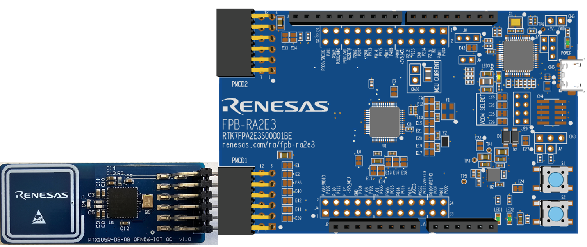

*Figure 1 — FPB-RA2E3 with PTX105R QC board seated in PMOD1*

| Resource | Detail |
|---|---|
| MCU | R7FA2E3073CFL — Arm Cortex-M23, 48 MHz HOCO |
| Flash / RAM | 64 KB Flash / 16 KB RAM (FreeRTOS overhead ~10 KB) |
| PMOD1 | SPI via SCI0 (P100/P101/P102/P103) + IRQ7 (P015) |
| Debug UART | SCI9 on P109 (TXD) / P110 (RXD) — 115200 8N1 |
| Debug interface | J10 Micro-USB → on-board J-Link OB (SWD) |
| LEDs | LED1 (P213) and LED2 (P914 / `PMOD1_GPIO9`) — both driven high together for the duration of each card transaction, then low. (P913 is `PMOD1_GPIO10` and P915 is `PMOD1_RESET`; neither is used as an LED by the current firmware.) |
| User button | SW1 (P200 / NMI) |

### 3.2 PTX105R Quick-Connect (QC) PMOD Board

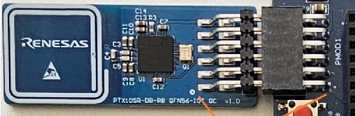

*Figure 2 — PTX105R-DB-RB QFN56-IOT QC v1.0 board*

| Feature | Detail |
|---|---|
| NFC IC | PTX105R |
| RF Protocols | ISO 14443-A/B, NFC-F (FeliCa), ISO 15693 |
| Antenna | Integrated 20 × 20 mm loop, on-board |
| Interface | 12-pin PMOD connector — plug directly into FPB-RA2E3 PMOD1 |
| SPI | 1 MHz, CPHA=0, CPOL=0 (SPI Mode 0), active-low CS |
| IRQ | Active-high rising edge on PMOD1 pin 7 (P015 / ICU IRQ7) |
| Power | 3.3 V from PMOD rail |

### 3.3 Pin Connections

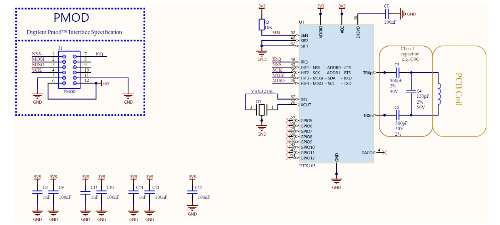

*Figure 3 — PTX105R-Schematic*

| PMOD1 Pin | Signal | FPB-RA2E3 Pin | SCI0 Function | Description |
|---|---|---|---|---|
| 1 | MISO | P100 | SCI0 RXD0 | Data from PTX105R to RA2E3 |
| 2 | MOSI | P101 | SCI0 TXD0 | Data from RA2E3 to PTX105R |
| 3 | SCK | P102 | SCI0 SCK0 | SPI clock (1 MHz, Master) |
| 4 | SS / CS | P103 | GPIO output | Chip select (active-low, software-driven GPIO, idle high) |
| 5 | GND | GND | — | Ground |
| 6 | 3V3 | 3.3 V | — | Power supply to PTX105R |
| 7 | IRQ | P015 | ICU IRQ7 | Active-high interrupt from PTX105R |
| 8 | RESET | P915 | GPIO (`PMOD1_RESET`) | PTX105R reset line (macro defined; not driven by current firmware) |

### 3.4 USB UART (Log Output)

Debug log output is available through the board's USB UART connection. Connect the FPB-RA2E3 to your PC with the USB cable on J10, then open the enumerated COM port in your serial terminal.

> **Note:** The PES itself has no UART dependency and can run completely headless. UART is only required by the demo application, for log output.

### 3.5 Software Requirements

| Software | Version / Notes |
|---|---|
| Renesas e² studio | 2025-01 or later |
| Renesas FSP | v6.4.0 |
| GCC ARM Embedded toolchain | 13.3.1 (bundled with FSP installer) |
| PTX105R IoT-Reader SDK | v7.2.0 (rm_nfc_reader_ptx_sdk v3.0.0+fsp.6.4.0) |
| FreeRTOS | via FSP (rm_freertos_port + Heap 4) |
| Serial terminal | Tera Term, PuTTY or any console app — 115200 8N1 |

For detailed steps on using e² studio, refer to the Renesas e² studio User Guide:
[e² studio | Renesas](https://www.renesas.com/en/software-tool/e2-studio?srsltid=AfmBOorTMc82ySC1OUrEN8SZbrQK2qXPYpFT_VatUYLmZMBeViM4bFTS)

The PTX105R IoT-Reader SDK is vendored in this repository under
`ra/renesas/wireless/ptx/rm_nfc_reader_ptx_sdk/` and is pulled in through the FSP
`rm_nfc_reader_ptx` stack — no separate SDK download is required.

### 3.6 First-Time vs-code Environment Setup

Before generating, building, or debugging in vs-code, run the one-time setup
script **once per machine**. It auto-detects the installed toolchains and stores
their locations as environment variables that the vs-code configuration reads.
Versions are auto-detected, so any installed version works.

#### Install these first

The setup script only *locates* tools — it does not install them by itself, but
it **can install the missing ones for you** (see next step). Make sure the
following are available on the machine:

| Tool | How to get it | Required? |
|---|---|---|
| vs-code | [Visual Studio Code](https://code.visualstudio.com) | Yes (code editor) |
| LLVM (ATfE) Arm toolchain | Installed with **e² studio** (Help ▸ Add Renesas Toolchains), or download from [arm/arm-toolchain releases](https://github.com/arm/arm-toolchain/releases) (assets named `ATfE-*`) | Yes (compile) |
| RA Smart Configurator (RASC) | [Renesas RA Smart Configurator](https://www.renesas.com/en/software-tool/ra-smart-configurator) | Yes (regenerate) |
| **CMake** (bundles **Ninja**) | [cmake.org/download](https://cmake.org/download/) or `winget install Kitware.CMake` | Yes (build) |
| Arm GNU toolchain (`arm-none-eabi-gdb`) | [Arm GNU Toolchain downloads](https://developer.arm.com/downloads/-/arm-gnu-toolchain-downloads) or `winget install Arm.ArmGnuToolchain` | Only for hardware debug |

> The LLVM (ATfE) toolchain and RASC are installed by the Renesas installers.
> **CMake**, **Ninja**, and the **Arm GNU debugger** are *not* — but the setup
> script below can install them automatically via `winget` (Windows 10/11).

#### Run the setup script

**Windows:** in File Explorer, **double-click `setup-env.cmd`**.

If a required tool (CMake / Ninja) or the optional debugger is missing, the
script lists what is missing and asks:

```
Install them now via winget? [y/N]
```

Answer **`y`** to let it install the missing tools automatically (no admin rights
needed for user-scope installs). When it finishes, **run the script again** so the
newly installed tools are detected and saved.

**Linux:** in a terminal, run:

```bash
bash setup-env.sh
```

Then apply the variables to your session by logging out and back in, or by
running `source ~/.profile`. On Linux, install missing tools with your package
manager, e.g. `sudo apt install cmake ninja-build gdb-arm-none-eabi`.

> No administrator/root rights are required. The script is safe to re-run any
> time you install a newer toolchain — it simply refreshes the detected paths.

The script detects and sets the following environment variables:

| Variable | Tool | Used for |
|---|---|---|
| `ARM_TOOLCHAIN_PATH` | LLVM (ATfE) `bin` folder | Compiling the project |
| `CMAKE_PATH` | `cmake` executable | Configuring & building (**required**) |
| `NINJA_PATH` | Ninja `bin` folder | Building |
| `ARM_GDB_PATH` | `arm-none-eabi-gdb` | Hardware debugging (optional) |
| `RASC_EXE_PATH` | RA Smart Configurator (optional) | Regenerating FSP files |

A successful run prints an `[OK]` line for each tool. If a tool is missing, a
`[WARN]` line explains what to install; install it and re-run the script.

> **Prerequisites:** The LLVM (ATfE) toolchain and RA Smart Configurator are
> installed with e² studio / RASC. **CMake** (which also provides **Ninja**) and,
> for hardware debugging, the **Arm GNU toolchain** (`arm-none-eabi-gdb`) must be
> installed separately if they are not already present — the script will tell you
> if they are missing.

> **IMPORTANT:** After the script finishes, **close and re-open VS Code** so it
> picks up the new environment variables.

---

## 4. FSP Configuration

FSP configuration can be done with **e² studio**, **Renesas Smart Configuration (RASC)**, or **vs-code with Renesas Extension**. The configuration itself will produce the same function regardless of the tool used. Refer to the documentation for your chosen tool:

- **e² studio**: [e² studio Integrated Development Environment User's Manual: Quick Start Guide](https://www.renesas.com/en/document/qsg/renesas-ra-family-e2-studio-2023-10-or-higher-quick-start-guide?r=488826) — See **CHAPTER 3: PROJECT GENERATION**
- **vs-code Extension**: [Renesas vs-code Extensions User Guide](https://tool-support.renesas.com/e2studio/vscode/docs/) — See **Section 3: Creating and Building a Project**
   - **Renesas Smart Configurator (RASC)**: [RA Smart Configurator | Renesas](https://tool-support.renesas.com/e2studio/vscode/docs/creating-and-building-project.html#using-renesas-ra) - See **Additional Details**

### 4.1 BSP Settings

| Setting | Value |
|---|---|
| FSP Version | 6.4.0 |
| Board | FPB-RA2E3 (board.ra2e3_fpb) |
| Device | R7FA2E3073CFL · LQFP48 · Cortex-M23 |
| RTOS | FreeRTOS (rm_freertos_port) |
| ROM / RAM | ~64 KB / ~16 KB |
| Main stack | 1,024 bytes |
| Heap | 256 bytes (FreeRTOS manages its own 2 KB heap) |
| MCU Vcc | 3,300 mV |
| Toolchain | GCC ARM Embedded 13.3.1 |

### 4.2 FSP Stack Overview

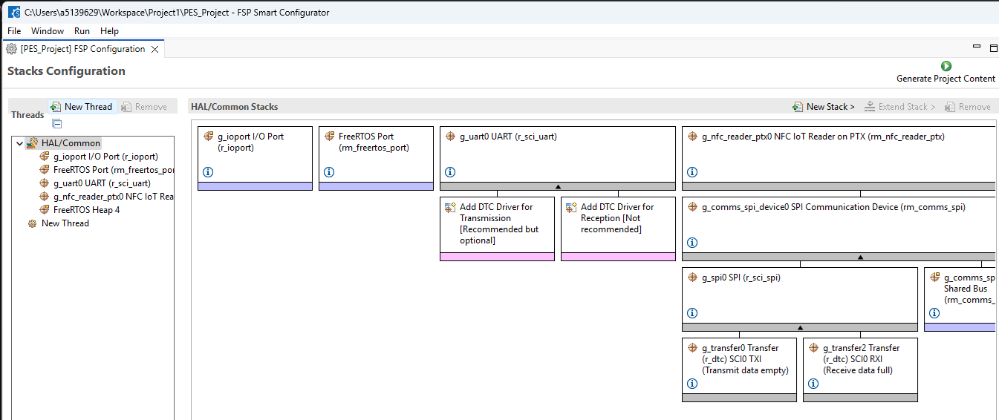

*Figure 4a — FSP Stacks tab: HAL/Common top-level view*


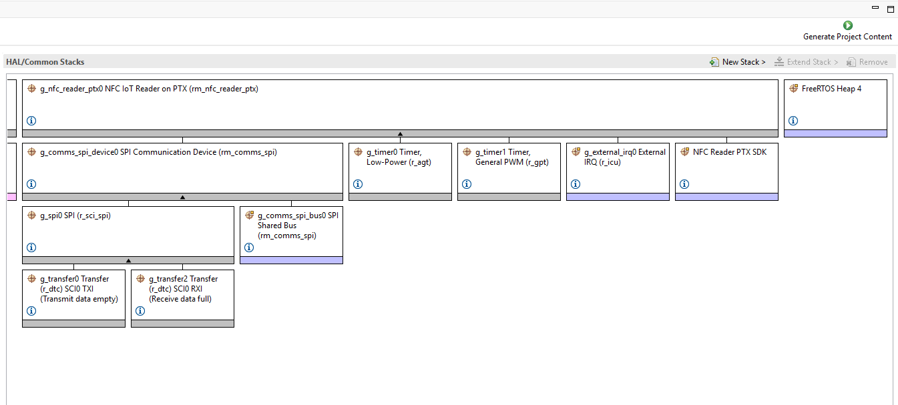

*Figure 4b — FSP Stacks tab: g_nfc_reader_ptx0 full stack expanded*

| FSP Module | Instance | Role |
|---|---|---|
| `rm_nfc_reader_ptx` | `g_nfc_reader_ptx0` | Config/context instance only — the `RM_NFC_READER_PTX_*` is bypassed; `rs_nfc_ptx105r.c` reads `g_nfc_reader_ptx0_cfg` and drives `ptxIoTRd_*` directly (see [7.1 Project Structure](#71-project-structure)) |
| `rm_nfc_reader_ptx_sdk` | — | PTX105R SDK v3.0.0 (NSC stack, RF protocol engine) |
| `rm_comms_spi` (bus) | `g_comms_spi_bus0` | SPI bus abstraction with mutex + blocking semaphore |
| `rm_comms_spi` (device) | `g_comms_spi_device0` | SPI device instance for PTX105R (CS active-low) |
| `r_sci_spi` | `ptx_pmod_spi` | SCI0 SPI Master — 1 MHz, CPHA=0, CPOL=0, MSB-first |
| `r_dtc` (TX + RX) | `g_transfer0` / `g_transfer1` | DTC for zero-CPU SPI DMA transfer |
| `r_icu` | `g_ext_irq` | ICU IRQ7 on P015 — rising-edge interrupt from PTX105R |
| `r_gpt` | `g_timer0` | GPT Ch0 — TDC timer, callback: ptxPLAT_TIMER_IsrCallback |
| `r_gpt` | `g_timer1` | GPT Ch1 — second PTX timing channel |
| `r_sci_uart` | `g_uart0` | SCI9 — 115200 8N1 UART on P109 (TX) / P110 (RX) |
| `r_ioport` | `g_ioport` | GPIO — LEDs, PMOD1_RESET (P915) |

### 4.3 SCI0 SPI & ICU IRQ7 Properties

**SCI0 SPI (ptx_pmod_spi)**

| Property | Value |
|---|---|
| Channel | SCI0 |
| Mode | Master |
| CPHA | 0 (leading edge) |
| CPOL | 0 (clock idle low) |
| Bit Order | MSB First |
| Bitrate | 1,000,000 bps |

**ICU IRQ7 (g_ext_irq)**

| Property | Value |
|---|---|
| Channel | 7 (P015) |
| Trigger | Rising Edge |
| Priority | 2 |

> **Note:** Move to another ICU IRQ if PTX IRQ is rerouted to a different external IRQ-capable pin, then FSP pin + ICU configuration is updated and code is regenerated (for example, vectors/common_data will change accordingly). For the rest of this document, we use **ICU IRQ7**.

### 4.4 Pin Assignments

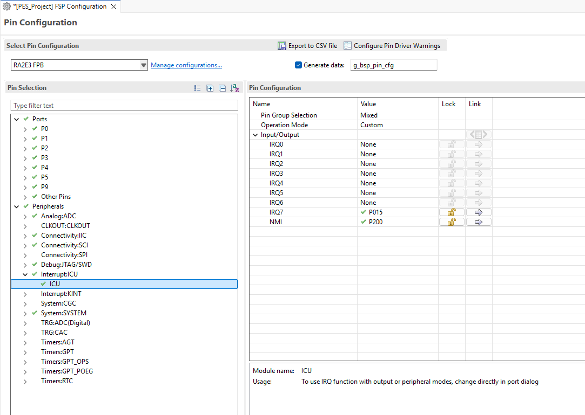

*Figure 5 — Assignments*

| Peripheral | Pin | Symbolic Name | Function |
|---|---|---|---|
| SCI0 RXD0 | P100 | `ARDUINO_D12_MISO_PMOD1_MISO` | SPI MISO ← PTX105R |
| SCI0 TXD0 | P101 | `ARDUINO_D11_MOSI_PMOD1_MOSI` | SPI MOSI → PTX105R |
| SCI0 SCK0 | P102 | `ARDUINO_D13_SCK_PMOD1_SCK` | SPI Clock |
| GPIO output | P103 | `ARDUINO_D10_SS_PMOD1_SS` | SPI CS (active-low, software GPIO) |
| ICU IRQ7 | P015 | `PMOD1_IRQ7` | PTX105R interrupt |
| SCI9 TXD9 | P109 | `ARDUINO_D1_TX` | UART TX → PC (log output) |
| SCI9 RXD9 | P110 | `ARDUINO_D0_RX` | UART RX ← PC (reserved) |
| GPIO (unused) | P915 | `PMOD1_RESET` | PTX105R RESET line (not driven by firmware) |

---

## 5. Demo Bring-Up

### Step 1: Hardware Setup

1. Keep the FPB-RA2E3 **unpowered** (USB disconnected) while making connections.
2. Align **pin 1** of the PTX105R QC board with **pin 1** of PMOD1 on the FPB-RA2E3 and press firmly until seated.
3. Connect the USB-UART adapter to P109 (RX) / P110 (TX) / GND using 3.3 V compatible jumper wires.
4. Connect a micro-USB cable to **J10**. The board powers on; PTX105R receives 3.3 V through PMOD1 automatically.

### Step 2: Add Project to IDE

> **Note:** Use step **2.A** for **e² studio** and step **2.B** for **vs-code**

### Step 2.A: Import the Project into e² studio

1. Launch **e² studio** and select or create a workspace. The path must **not contain spaces**.  
   `C:\workSpace` ← Good &nbsp;&nbsp; `C:\work Space` ← Bad
2. **File → Import → General → Existing Projects into Workspace → Next**.
3. Click **Browse** → navigate to the `nfc-ptx105r-ra2e3` project folder. The wizard detects **RA2E3_nfc_reader** automatically. Click **Finish**.
4. The project ships with two build configurations: **Debug** and **PtxIotReaderApp_SPI_Release**. For bring-up, right-click the project → **Build Configurations → Set Active → Debug**.

### Step 2.B: Open Project into vs-code

1. Launch **vs-code** and **File → Open Folder**.
2. Navigate to the `nfc-ptx105r-ra2e3` project folder. Click **Select Folder**.
3. On the popup window, select **ARM LLVM (ATfE) Ninja LLVM-embedded-toolchain-for-Arm (clang) with Ninja**.
4. The default build configuration is **Debug**, and this is the one you need.

### Step 3: Review FSP Configuration

Double-click `configuration.xml` to open the RA Configuration view. Verify BSP tab (device R7FA2E3073CFL, FSP 6.4.0), Stacks tab (full NFC driver stack), and Pins tab (SCI0 + IRQ7 assignments).

### Step 4: Build

> **Note:** Use step **4.A** for **e² studio** and step **4.B** for **vs-code**

### Step 4.A: Build e² studio
1. Confirm the active build configuration is **Debug**.
2. Press **Ctrl+B** or right-click the project → **Build Project**.
3. A successful build prints zero errors:

```
**** Incremental Build of configuration Debug ****
   text    data     bss     dec     hex filename
  62636     160   15157   77953   13081 RA2E3_nfc_reader.elf
Build Finished. 0 errors, 0 warnings.
```

Output files are written to `Debug/`: `RA2E3_nfc_reader.elf` · `.srec` · `.map`

### Step 4.B: Build vs-code
1. Press the Build icon on the bottom bar, or the Build button in the **CMake** tool on the right panel.
2. A successful build prints zero errors:

```
 [build] [89/89 100% :: 26.089] Linking C executable ra2e3_ptx_Iot_fsp_reader.elf
 [driver] Build completed: 00:00:26.473
 [build] Build finished with exit code 0
```

Output files are written to `build/Debug/`: `ra2e3_ptx_Iot_fsp_reader.elf` · `.srec` · `.map`

### Step 5: Flash & Run

> **Note:** Use step **5.A** for **e² studio** and step **5.B** for **vs-code**

### Step 5.A: Flash & Run e² studio
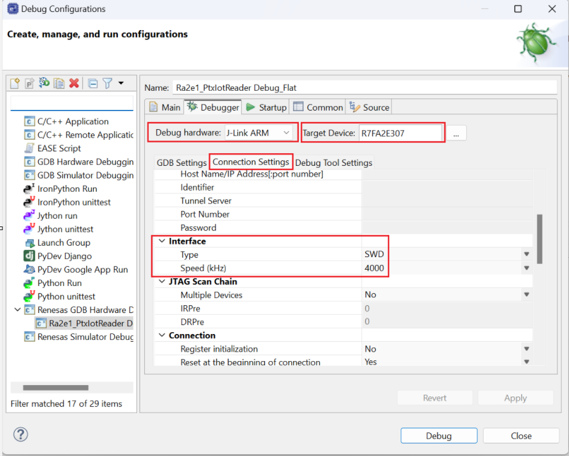

*Figure 6a — Debug Config*

1. Confirm the micro-USB cable is connected to J10 and the board is powered.
2. **Run → Debug Configurations...** → double-click **Renesas GDB Hardware Debugging → RA2E3_nfc_reader Debug_Flat**.
3. If configuring manually, verify the Debugger tab: **J-Link (Renesas)**, target **R7FA2E307**, interface **SWD at 4 MHz**.
4. Click **Debug**. e² studio downloads the `.elf` to the RA2E3 via J-Link and halts at `main()`.
5. Press **Resume (F8)** to start execution.

Call chain:
```
main()                          ← FSP generated
└─ new_thread0_entry()          ← calls app_nfc_reader_entry()
   └─ app_nfc_reader_init()
      └─ rs_nfc_reader_Read()    ← spawns "RS_NFC" worker task
         └─ RS_NFC task              ← NFC event loop runs forever
```

> **Note:** You may need to press **Resume** twice — once past a reset handler breakpoint, once to start `main()`. If the session hangs, press SW1 (RESET) on the FPB-RA2E3 then Resume again.

### Step 5.B: Flash & Run vs-code
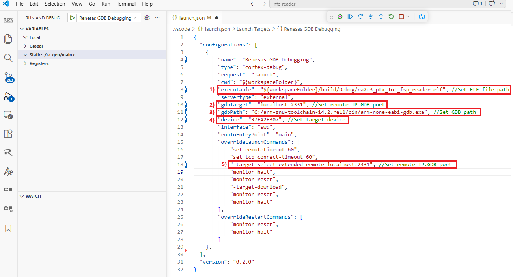

*Figure 6b — Debug Config*

1. Confirm the micro-USB cable is connected to J10 and the board is powered.
2. Press **Ctrl+Shift+D** to open **Run and Debug**, then configure the **launch.json** file.
3. Set the following:
   1) For **"executable"** Set ELF file path
   2) For **"gdbTarget"** set remote IP:GDB port
   3) For **"gdbPath"** Set GDB path
   4) For **"device"** Set target device ("R7FA2E307")
   5) For **"-target-select extended-remote localhost:2331"** Set remote IP:GDB port
4. Click the **Start Debugging** icon; vs-code downloads the `.elf` to the RA2E3 via J-Link and halts at `main()`.
5. Use the debug icons to debug.

Call chain:
```
main()                          ← FSP generated
└─ new_thread0_entry()          ← calls app_nfc_reader_entry()
   └─ app_nfc_reader_init()
      └─ rs_nfc_reader_Read()    ← spawns "RS_NFC" worker task
         └─ RS_NFC task              ← NFC event loop runs forever
```


> **Note:** For integration into your own project or customer hardware, check 12. [Integration Recommended](#12-integration-recommended) for the required differences (BSP device selection, pin/channel remap, and stack configuration updates). This Section flow is for running the packaged demo on the reference hardware.

---

## 6. Usage

### 6.1 UART Terminal

1. Open your serial terminal (Tera Term, PuTTY or any console app) at **115200 baud, 8N1**.


2. On startup the application prints:


```
System Initialization (RS NFC Reader) ... starting
RS NFC Reader launched (non-blocking)
```

3. Place an NFC card within **5–10 cm** of the PTX105R antenna. Example output for a Type 4A tag:

```
CARD DETECTED! type=NFC-T4A UID=02840017810196 NDEF=15B
RF Technology  : TYPE A
Tag Type       : ISO-DEP (Type 4 Tag / ISO 14443-4)
Serial Number  : 02:84:00:17:81:01:96
Size           : 8192 bytes
Writeable      : Yes
NDEF           : 15 bytes
  NDEF raw (15 bytes): D1 01 0B 54 02 65 6E 59 4F 20 45 4C 49 4E 41
```

### 6.2 LED Feedback

On every card transaction the firmware drives **LED1 (P213)** and **LED2 (P914 / `PMOD1_GPIO9`)** HIGH together at the start of the card event, then LOW once the card has been processed. There is **no per-card-type LED coding and no timed blink** — the two LEDs simply act as a single "card active" indicator.

| Event | LED Action |
|---|---|
| Card detected / being processed | LED1 + LED2 driven HIGH |
| Field clear / processing done | LED1 + LED2 driven LOW |

> **Note:** LED feedback is compiled in via `APP_NFC_READER_LED_EN` in `app_nfc_reader.h`; comment out that macro to disable LED code entirely.

---

## 7. Data Flow Architecture

### 7.1 Project Structure

Root path: `C:\wrk\nfc-ptx105r-ra2e3\`

```
nfc-ptx105r-ra2e3/
│
├── src/
│   ├── hal_entry.c                        ← FSP HAL entry hook
│   ├── new_thread0_entry.c                ← FreeRTOS task entry → app_nfc_reader_entry()
│   │
│   ├── app_nfc_reader/                    ← APP Layer: Application + LED + log
│   │   ├── app_nfc_reader.c/.h            ← App entry, card-event callback, LED helpers
│   │   └── app_nfc_reader_log.c/.h        ← UART log + card-info print
│   │
│   ├── nfc_reader/                        ← PES Module: NFC protocol orchestration
│   │   ├── include/
│   │   │   └── rs_nfc_reader.h            ← PES public API header (single include)
│   │   ├── pack/
│   │   │   └── RA2E3/configuration.xml    ← Pack-specific FSP configuration
│   │   ├── src/                           ← Flat layout
│   │   │   ├── rs_nfc_reader.c            ← RS reader + "RS_NFC" task (detect, retry, dependency check, card summary)
│   │   │   ├── rs_ndef_read.c             ← NDEF read (T2T page/TLV; T4T/T5T via PTX SDK) + record decode
│   │   │   └── ptx105r/
│   │   │       ├── rs_nfc_ptx105r.c       ← PTX105R HAL → direct ptxIoTRd_* / ptxPLAT_* calls
│   │   │       ├── rs_nfc_ptx105r.h
│   │   │       └── rs_nfc_ptx105r_board.h
│   │   └── test/                          ← Unit-test placeholders + PTX105R mock
│   │       ├── test_nfc_reader.c
│   │       ├── test_ndef_read.c
│   │       └── mocks/mock_ptx105r_adapter.c
│
├── ra_gen/                                ← FSP-generated files (do not edit)
├── ra_cfg/                                ← FSP configuration headers (do not edit)
│   └── fsp_cfg/
│       └── rm_nfc_reader_ptx_cfg.h        ← NFC reader FSP config
├── ra/                                    ← FSP + CMSIS + FreeRTOS + PTX SDK sources
├── script/
│   └── fsp.ld                             ← Linker script
├── configuration.xml                      ← FSP stack + pin config (open in e² studio)
└── RA2E3_nfc_reader Debug_Flat.launch     ← Pre-configured J-Link debug launch
```

> **Note:** Never manually edit files in `ra_gen/` or `ra_cfg/`. These are regenerated by the FSP tooling whenever `configuration.xml` is saved.

### 7.2 Software-Layer Architecture

Use this mental model: each layer has one clear responsibility and only calls the layer directly below it.

| Layer | Main responsibility | Key files |
|---|---|---|
| Application (APP) | Product behavior (logs, LED, when to read) | `src/app_nfc_reader/app_nfc_reader.c`, `src/new_thread0_entry.c` |
| PES module | NFC state machine (discover, activate, read, callback, deactivate, loop) | `src/nfc_reader/src/rs_nfc_reader.c`, `rs_ndef_read.c` |
| PTX105R adapter | Converts PES module calls to PTX SDK operations | `src/nfc_reader/src/ptx105r/rs_nfc_ptx105r.c`, `rs_nfc_ptx105r.h` |
| PTX SDK + FSP drivers | NFC protocol ops and MCU peripheral access | `ptxIoTRd_*`, `ptxPLAT_*`, `R_SCI_SPI`, `R_ICU`, `R_GPT` |
| Hardware | Physical RF + MCU execution platform | RA2E3 board + PTX105R PMOD |

**Important boundary**

The PTX adapter (`rs_nfc_ptx105r.c`) calls `ptxIoTRd_*` directly. The `RM_NFC_READER_PTX_*` wrapper layer is intentionally bypassed in this project.

**Call flow (top-down)**

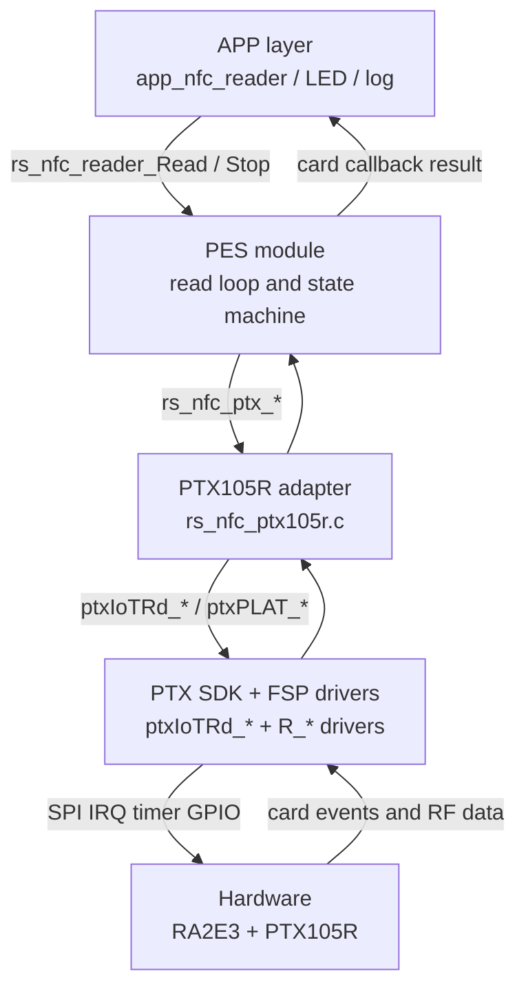

**One runtime cycle (reader mode)**

1. APP starts reader by calling `rs_nfc_reader_Read()`.
2. RS task performs discovery and waits for card activation.
3. RS calls PTX adapter for activate + data exchange.
4. NDEF is parsed/read.
5. APP callback receives UID/card/NDEF info.
6. RS deactivates card and returns to discovery loop.

This split keeps APP logic independent from PTX hardware details, so APP + RS layers are reusable while only the PTX adapter is board/reader specific.

### 7.3 FreeRTOS Task Map

FreeRTOS is required for the non-blocking RS mode, because `rs_nfc_reader_Read()` creates and runs the asynchronous `RS_NFC` worker task.

| Task | Created by | Stack | Priority | Role |
|---|---|---|---|---|
| `new_thread0` | FSP (static) | 1 KB (1024 B) | 1 | Calls app_nfc_reader_entry() then suspends |
| `RS_NFC` | rs_nfc_reader_Read() | ~4 KB (static) | 1 | Runs full NFC event-loop. Self-deletes when stopped. |
| `IDLE` | FreeRTOS kernel | 512 B | 0 | FreeRTOS idle task |

**Per-task notes**

- `new_thread0`: Startup task created by FSP. After initialization it suspends, so its stack remains reserved but mostly idle during normal operation.
- `RS_NFC`: Main worker task for discovery/activation/read/deactivation and callback dispatch. This stack is sized larger because protocol handling and card I/O paths are deeper than startup or idle paths.
- `IDLE`: Mandatory kernel task that runs when no other ready task exists. It provides background kernel housekeeping and must always have enough stack for the port's idle-path hooks.

The stack column is reserved RAM per task, so these three tasks consume about 5.5 KB of fixed stack budget in total. In practice, add a small extra margin for each task's TCB/control data and keep some free headroom to avoid stack overflow under peak paths.

> **Note:** All task stacks are **statically allocated**. `configSUPPORT_STATIC_ALLOCATION` must be `1` in `FreeRTOSConfig.h`. The FreeRTOS heap (2 KB) is reserved for the kernel only.

### 7.4 PES Configuration

PES is the main NFC coordination layer in this project. The APP layer configures PES once, then PES handles discovery, activation, read/callback dispatch, and clean shutdown. All available functions are listed in ** 7.5 [PES Functions](#75-pes-functions)** below.

#### Configuration Struct

`rs_nfc_reader_cfg_t` is the main input to PES. The application layer fills it in `app_nfc_reader_init()` before calling `rs_nfc_reader_Read()`.

```c
typedef struct st_rs_nfc_reader_cfg {
    rs_nfc_tech_mask_t      tech_mask;
    uint32_t                timeout_ms;
    uint8_t                 retry_count;
    bool                    read_ndef;
    uint16_t                max_ndef_bytes;
    bool                    run_raw_exchange;
    rs_nfc_callback_t       callback;
    void                   *p_context;
    rs_nfc_card_event_cb_t  on_card_event;
    void                   *p_card_event_context;
    bool                    validate_dependencies;
    bool                    cfg_valid_check_en;
} rs_nfc_reader_cfg_t;
```

| Field | Type | Meaning |
|---|---|---|
| `tech_mask` | `rs_nfc_tech_mask_t` | Technologies to poll for. The project uses `RS_NFC_TECH_ALL` (ISO 14443-A/B, NFC-F, ISO 15693, NFC Forum). |
| `timeout_ms` | `uint32_t` | Maximum run time for `rs_nfc_reader_Read()`. `UINT32_MAX` (`RS_NFC_TIMEOUT_INFINITE`) means run forever. |
| `retry_count` | `uint8_t` | Per-operation retry budget. `0` (`RS_NFC_RETRY_DISABLED`) disables retries. |
| `read_ndef` | `bool` | When `true`, PES reads NDEF data for a detected card and fills the result struct. |
| `max_ndef_bytes` | `uint16_t` | Upper bound on the NDEF payload copied into `result->ndef_data`. The project uses `RS_NFC_NDEF_MAX_BYTES`. |
| `run_raw_exchange` | `bool` | When `true`, after activation PES performs a protocol-appropriate raw frame exchange and exposes it via `result->raw_exchange`. No effect for ISO-DEP. |
| `callback` | `rs_nfc_callback_t` | Completion callback for non-blocking `Read()`. If `NULL`, `Read()` uses the blocking flow and no completion callback fires. |
| `p_context` | `void *` | User context passed back to `callback`. May be `NULL`. |
| `on_card_event` | `rs_nfc_card_event_cb_t` | Per-card callback fired each time a card is detected and activated — the important hook for the application. |
| `p_card_event_context` | `void *` | User context passed back to `on_card_event`. |
| `validate_dependencies` | `bool` | When `true`, PES also checks the lower-level PTX105R stack is ready before starting. |
| `cfg_valid_check_en` | `bool` | Gate for `rs_nfc_reader_validate()` inside `Read()`. Because `memset(&cfg,0,...)` zeroes it to `false`, callers must set it to `true` to keep config validation enabled. |

#### Result Struct

`rs_nfc_card_result_t` is the per-card payload handed to the application callback. It is populated by the PES read flow, then reused on the next card event, so the application must copy anything it needs after the callback returns.

```c
struct st_rs_nfc_card_result {
    rs_nfc_card_type_t  card_type;
    rs_nfc_protocol_t   protocol;
    uint8_t             uid[RS_NFC_UID_MAX_BYTES];
    uint8_t             uid_len;
    bool                ndef_present;
    uint8_t             ndef_data[RS_NFC_NDEF_MAX_BYTES];
    uint16_t            ndef_len;
    rs_ndef_decoded_t   decoded;
    int8_t              rssi_dbm;
    uint32_t            read_time_ms;

    uint32_t            data_area_size;
    bool                writeable;
    const char         *tag_type_name;

    rs_nfc_raw_exchange_t raw_exchange;
};
```

| Field | Type | Meaning |
|---|---|---|
| `card_type` | `rs_nfc_card_type_t` | Normalized card classification such as T2T, T4A, T4B, T3T, or T5T. |
| `protocol` | `rs_nfc_protocol_t` | Active RF protocol (T2T / T3T / ISO-DEP / T5T / …). |
| `uid` | `uint8_t[10]` | Raw UID bytes as read from the card. |
| `uid_len` | `uint8_t` | Number of valid bytes in `uid`. |
| `ndef_present` | `bool` | `true` if PES found an NDEF message on the card. |
| `ndef_data` | `uint8_t[512]` | NDEF payload buffer. |
| `ndef_len` | `uint16_t` | Length of valid data in `ndef_data`. |
| `decoded` | `rs_ndef_decoded_t` | NDEF records parsed from `ndef_data` by `rs_nfc_reader_Read()`. Each record's `payload` points into `ndef_data`, so it is valid only while this result is alive. |
| `rssi_dbm` | `int8_t` | Optional RF signal strength. Some backends leave it `0` if unsupported. |
| `read_time_ms` | `uint32_t` | Time spent reading the current card event. |
| `data_area_size` | `uint32_t` | Card capacity derived from the card's capability data. |
| `writeable` | `bool` | `true` if the detected card reports write access (informational; firmware does not write). |
| `tag_type_name` | `const char *` | Human-readable tag description, e.g. `NFC Forum Type 2 Tag (T2T)`. Static string — do not free. |
| `raw_exchange` | `rs_nfc_raw_exchange_t` | Snapshot of the last raw protocol exchange (valid/status/tx/rx). Populated only when `run_raw_exchange = true`; check `.valid` before use. |

### 7.5 PES Functions

#### PES Functions Reference

| Function | Scope | Purpose | Notes |
|---|---|---|---|
| `rs_nfc_reader_Read()` | Public | Start the NFC flow | Blocking when `callback == NULL`, non-blocking when `callback != NULL`. Loops one event per card when `on_card_event` is set. |
| `rs_nfc_reader_Stop()` | Public | Stop a running read | Wakes the blocked wait and exits cleanly. Returns `RS_OK` always. |

> **Note:** These two functions are the **entire public API**. Card-info reading and NDEF record decoding happen internally during `Read()` — the parsed records are delivered to the application in `result->decoded`, so no separate decode call is exposed.

#### Typical Application Setup

The project currently configures PES from `app_nfc_reader_init()` like this:

```c
rs_nfc_reader_cfg_t cfg;
memset(&cfg, 0, sizeof(cfg));
cfg.tech_mask             = RS_NFC_TECH_ALL;
cfg.timeout_ms            = RS_NFC_TIMEOUT_INFINITE;
cfg.retry_count           = RS_NFC_RETRY_DISABLED;
cfg.read_ndef             = RS_NFC_NDEF_READ_ENABLED;
cfg.max_ndef_bytes        = RS_NFC_NDEF_MAX_BYTES;
cfg.run_raw_exchange      = RS_NFC_RAW_EXCHANGE_ENABLED;
cfg.callback              = on_nfc_operation_done;
cfg.p_context             = RS_NFC_CONTEXT_NONE;
cfg.on_card_event         = on_nfc_read_done;
cfg.p_card_event_context  = RS_NFC_CONTEXT_NONE;
cfg.validate_dependencies = RS_NFC_DEP_VALIDATION_DISABLED;
cfg.cfg_valid_check_en    = RS_NFC_CFG_VALIDATION_ENABLED;

/* Non-blocking: pass NULL for result_out — the RS_NFC worker task uses
 * its own task-local result buffer. Passing the address of a caller-local
 * would dangle once the caller returns. */
(void)rs_nfc_reader_Read(&cfg, NULL);
```

#### What To Keep In Mind

- `on_card_event` is the important PES hook for the project. It fires once per detected card.
- `callback` is only for completion of a non-blocking `Read()` call.
- The result struct is reused by PES, so copy any data you need after the callback returns.
- PES reads the card info (capacity, write access, tag name) and decodes the NDEF records into `result->decoded` internally, before firing `on_card_event` — the app just reads the result fields.

---

## 8. Callback Behavior

### 8.1 Runtime Flow

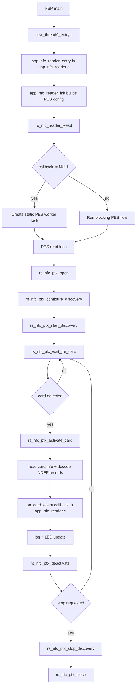

### 8.2 File-Level Ownership Flow

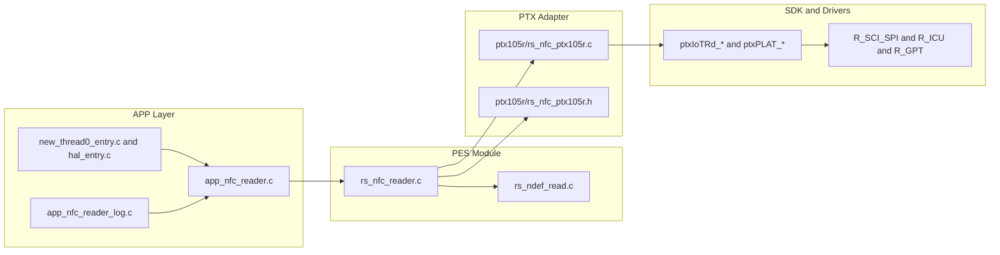

### 8.3 NDEF Read Decision Flow

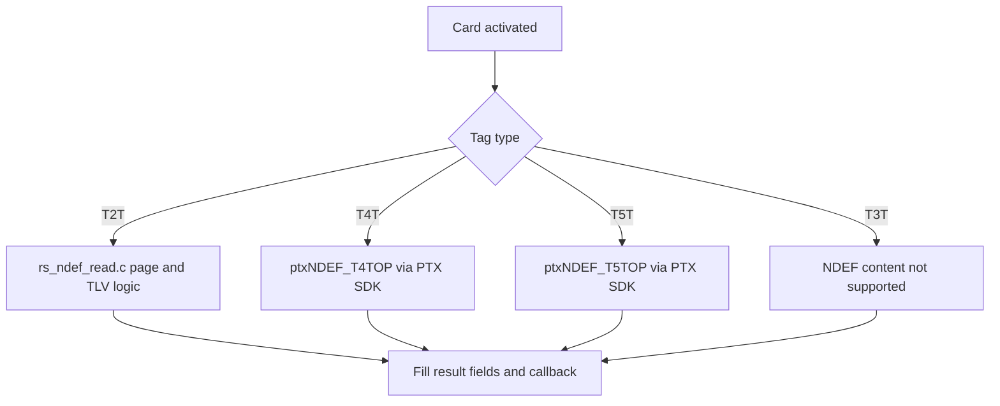

> **Note:** This release only *reads* NDEF. There is no write/erase path — NDEF write is not implemented for any tag type.

### 8.4 Stop Path Flow

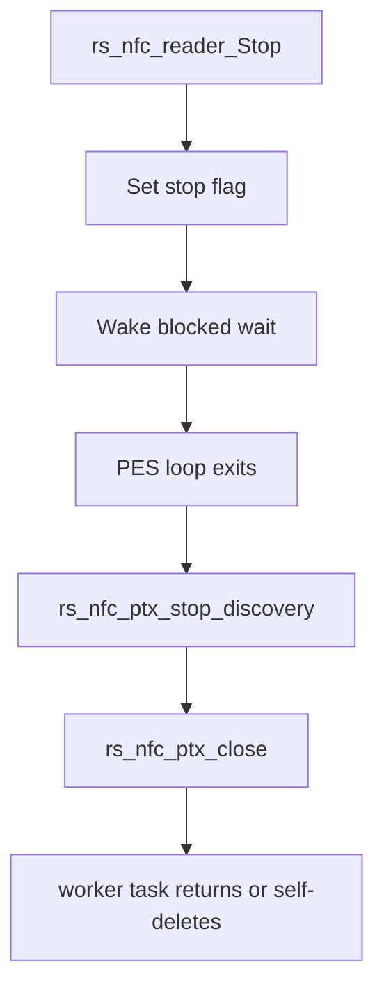

---

## 9. Configuration Parameters

Key FSP and firmware configuration options:

| Parameter | File | Default | Purpose |
|---|---|---|---|
| `configMAX_PRIORITIES` | `FreeRTOSConfig.h` | 3 | Task priority levels |
| `configTIMER_TASK_STACK_DEPTH` | `FreeRTOSConfig.h` | 128 | FreeRTOS timer task stack size (words) |
| `RS_NFC_NDEF_MAX_BYTES` | `rs_nfc_reader.h` | 512 | Maximum NDEF message size |
| `UART baud rate` | FSP Configurator (`g_uart0`) | 115200 | Debug log output speed |
| `SPI clock` | FSP Configurator (`ptx_pmod_spi`) | 1 MHz | PTX105R SPI communication speed |

---

## 10. Error Handling

Common error scenarios and recovery. The PES layer reports status via the `rs_status_t`
enum (`rs_nfc_reader.h`):

| Status / Error | Cause | Recovery |
|---|---|---|
| `RS_ERR_TIMEOUT` | Card removed or polling timeout | Retry detection in main loop |
| `RS_ERR_INVALID_CFG` | Malformed `rs_nfc_reader_cfg_t` | Fix config fields; keep `cfg_valid_check_en = true` |
| `RS_ERR_DEPENDENCY` | Lower PTX105R stack not ready | Verify FSP stack + `validate_dependencies` |
| `RS_ERR_NOT_FOUND` | Card not NDEF-formatted | Log and continue polling |
| `RS_ERR_BUFFER_OVERFLOW` | NDEF larger than `max_ndef_bytes` | Increase `max_ndef_bytes` (≤ `RS_NFC_NDEF_MAX_BYTES`) |
| `RS_ERR_INTERNAL` | Second non-blocking `Read()` while one is active, or internal fault | Stop the running read first; reset PTX105R if persistent |

---

## 11. Limitations

* **NDEF write/erase**: Not implemented in this release — the firmware is a **read-only** reader for all tag types (T2T/T3T/T4T/T5T).
* **NDEF T3T (FeliCa)**: Detection and UID reporting only; NDEF content read is not supported.
* **SPI transport scope**: The current PTX105R integration is validated only with SCI-SPI. Dedicated RA SPI peripherals such as `R_SPI` are not supported in this release.
* **Simultaneous card detection**: Only one card can be activated per read cycle.
* **NDEF message size**: Limited by on-tag memory and by `RS_NFC_NDEF_MAX_BYTES` (512 bytes).
* **RA2E3 RAM**: 16 KB total; dynamic allocation is minimal. All task stacks are statically allocated.
* **FreeRTOS heap**: 2 KB reserved for kernel; user malloc limited by remaining RAM.
* **ISO 15693 (NFC-V)**: Basic detection supported; advanced features (AFI, DSFID) not implemented.

---

## 12. Integration Recommended

> **Note:** If you're running the packaged demo on the reference hardware, see [5. Demo Bring-Up](#5-demo-bring-up). This section is intended for integrating the code into your own project and hardware.

When moving to a different RA MCU board, only a few layers need to change — the PES module, NDEF layer, and overall application flow are portable, and the APP layer can be reused as-is or adapted to your product behavior. The integration touch-points are concentrated in `configuration.xml` (BSP device, stacks, pins) and the two PTX board-adapter files (`rs_nfc_ptx105r_board.h` / `rs_nfc_ptx105r.c`).

This section walks through that work:

* [12.1 Integration Guide](#121-integration-guide) — the ordered, step-by-step procedure.
* [12.2 Adapting to Custom Board Wiring](#122-adapting-to-custom-board-wiring) — the signal-by-signal remapping reference.
* [12.3 Integration Checklist](#123-integration-checklist) — final verification before running on your board.

---

### 12.1 Integration Guide

Follow these steps, in order, when bringing this code into your own project or custom hardware:

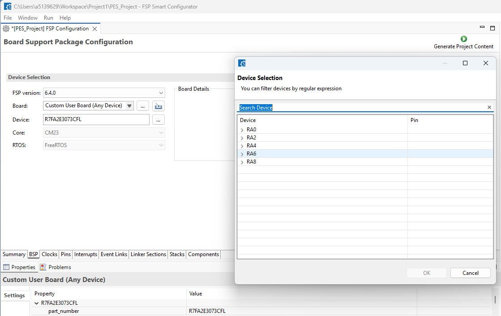

*Figure 7 — BSP Device Selection*

1. **Select the BSP device, then verify required MCU modules using the Hardware User's Manual (HWUM).** In `configuration.xml` BSP tab, select your exact MCU/device package first (Figure 7). Then confirm that device has: an SPI-capable SCI channel (or a dedicated SPI channel), an external-IRQ-capable pin, a spare GPIO output for reset/chip-select, a DTC/DMAC channel for SPI transfers, and — only if you need log output — a spare UART channel. Also confirm two GPT timer channels are available for the PTX timing services (`g_timer0` / `g_timer1`).
2. **Verify pin/channel mapping against your schematic.** Cross-reference the MCU pin-function tables in the HWUM with your board schematic to decide which physical pins will carry SPI (MISO/MOSI/SCK/CS), IRQ, RESET, and (optionally) UART. Use [ 12.2 Adapting to Custom Board Wiring](#122-adapting-to-custom-board-wiring) as the list of what to reassign in `configuration.xml` and `rs_nfc_ptx105r_board.h`.
3. **Selectively import only the layers you need into your project's `src/`.**
   - **Always required:** the PTX adapter (`src/nfc_reader/src/ptx105r/`) and the PES module files (`src/nfc_reader/src/rs_nfc_reader.c`, `rs_ndef_read.c`).
   - **Optional:** `src/app_nfc_reader/` (LED, log) — omit or replace with your own application layer if you don't need the demo's LED/log behavior.
   - **Do not copy:** `ra_gen/` and `ra_cfg/` — these are FSP-generated and must be produced fresh for your own project/board configuration (see [7.1 Project Structure](#71-project-structure)).

Once these three steps are complete, validate the result against [ 12.3 Integration Checklist](#123-integration-checklist).

---

### 12.2 Adapting to Custom Board Wiring

When moving the PTX105R connection off the reference PMOD1 wiring (for example, onto a customer's own board or a different connector layout), the following signals can be remapped. Most changes are confined to `configuration.xml` (Stacks + Pins) and are picked up through the FSP-generated headers; `rs_nfc_ptx105r_board.h` exposes the external-IRQ instance/callback used by the adapter.

| Signal | Reference (FPB-RA2E3) | What can change | Where to update |
|---|---|---|---|
| SPI (MISO/MOSI/SCK/CS) | SCI0 · P100–P103 | Any SCI channel with SPI support (see 4.3 [SCI0 SPI & ICU IRQ7 Properties](#43-sci0-spi--icu-irq7-properties)) | `configuration.xml` Stacks tab (`ptx_pmod_spi`) + Pins tab |
| DTC transfer instances | `g_transfer0` (TX) / `g_transfer1` (RX) on SCI0 | Must be reassigned to match the new SCI channel's transfer request line | `configuration.xml` Stacks tab — regenerate after changing the SPI channel |
| IRQ | ICU IRQ7 · P015 | Any external-IRQ-capable pin | `configuration.xml` Stacks (`g_ext_irq`) + Pins tab — see note in 4.3 [SCI0 SPI & ICU IRQ7 Properties](#43-sci0-spi--icu-irq7-properties)) (`vector_data.h`/`common_data` regenerate); the adapter picks up `g_ext_irq` via `rs_nfc_ptx105r_board.h` |
| RESET | GPIO P915 (`PMOD1_RESET`) | Any GPIO output pin | `configuration.xml` Pins tab (macro `PMOD1_RESET` in generated `bsp_pin_cfg.h`) |
| UART (log — optional) | SCI9 · P109 (TX) / P110 (RX) | Any UART-capable SCI channel, or can be omitted entirely if log output isn't needed | `configuration.xml` (`g_uart0`); `src/app_nfc_reader/app_nfc_reader_log.c` |
| Power | 3.3 V from PMOD1 rail | PTX105R always requires a regulated 3.3 V supply from the host board | Host board power rail |

> **Note:** If the target is a **different RA MCU** (not just different wiring on the same MCU), also re-verify the clock tree in `bsp_clock_cfg.h` and the availability of the two GPT timer channels used by `g_timer0` / `g_timer1`.

---

### 12.3 Integration Checklist

Before running your application on **your own board**, verify the following (values shown for the reference FPB-RA2E3/PTX105R setup are examples only — substitute your own MCU, channels, and pins):

* [ ] Target device and BSP in FSP match **your** hardware (MCU part number, package, FSP version) — confirmed against your MCU's HWUM.
* [ ] Required peripheral modules are available on your MCU and not already claimed by another function: an SPI-capable channel, an external-IRQ-capable pin, a GPIO output, a DTC/DMAC channel, and (if used) a UART channel — see 12.1 [Integration Guide](#121-integration-guide).
* [ ] Pin/channel mapping matches your schematic for SPI (MISO/MOSI/SCK/CS), IRQ, RESET, and UART (if used) — see 12.2 [Adapting to Custom Board Wiring](#122-adapting-to-custom-board-wiring).
* [ ] Active build configuration matches your project (the reference debug config is named `Debug`; the release config is `PtxIotReaderApp_SPI_Release`).
* [ ] PTX105R middleware stack exists and is connected: NFC reader config instance + SPI bus instance + SPI device instance (`g_nfc_reader_ptx0` / `g_comms_spi_bus0` / `g_comms_spi_device0`, or your renamed equivalents).
* [ ] SPI driver instance is configured to match the PTX105R spec: **master**, **1 MHz**, **CPOL=0**, **CPHA=0** (see 3.2 [PTX105R QC PMOD Board](#32-ptx105r-quick-connect-qc-pmod-board)), on the channel you selected.
* [ ] DTC (or DMAC) transfer instances for SPI TX/RX are enabled and match the SPI channel you selected.
* [ ] External IRQ instance is configured on the pin you selected, with rising-edge trigger.
* [ ] PTX reset GPIO is present, configured as output, and wired to the pin you selected.
* [ ] UART instance exists only if you need log output, on the channel/pins you selected.
* [ ] Terminal baud (if UART is used) matches the FSP `g_uart0` baud setting (115200 8N1 by default); the log backend lives in `src/app_nfc_reader/app_nfc_reader_log.c`.
* [ ] FreeRTOS settings are valid for your app: `configSUPPORT_STATIC_ALLOCATION=1` and heap sized for your workload.
* [ ] Project builds and links with no unresolved symbols from the NFC reader/PTX, SPI, IRQ, DTC/DMAC, and UART components you selected.
* [ ] Hardware wiring is correct per your schematic: PTX105R module wired to the pins you selected, and (if used) UART adapter connected with matching RX/TX/GND.

---

## 13. Example

### Typical NDEF Read Sequence

```c
#include "rs_nfc_reader.h"
#include "FreeRTOS.h"
#include "task.h"
#include <string.h>

/* ① Per-card event callback (fires once per detected/activated card).
 *    `result` and `summary` are valid ONLY for the duration of this call. */
static void my_card_event(rs_status_t                  status,
                          const rs_nfc_card_result_t * result,
                          const char                 * summary,
                          void                       * p_context)
{
    (void)p_context;
    (void)status;

    if (NULL == result)                 /* informational / warning event */
    {
        if (NULL != summary) { /* log summary */ }
        return;
    }

    /* e.g. "CARD DETECTED! type=NFC-T4A UID=02840017810196 NDEF=15B" */
    /* print summary, then consume the pre-populated result fields */
    if (result->ndef_present)
    {
        /* result->ndef_data holds result->ndef_len bytes */
    }
}

/* ② Optional completion callback for the non-blocking Read(). */
static void my_operation_done(rs_status_t status, void *p_context)
{
    (void)p_context;
    (void)status;
}

/* ③ Configure and start the reader (non-blocking) */
static rs_nfc_card_result_t g_result;  /* must persist — reused by RS_NFC task */

void app_entry(void)
{
    rs_nfc_reader_cfg_t cfg;
    memset(&cfg, 0, sizeof(cfg));
    cfg.tech_mask             = RS_NFC_TECH_ALL;
    cfg.timeout_ms            = RS_NFC_TIMEOUT_INFINITE;
    cfg.read_ndef             = RS_NFC_NDEF_READ_ENABLED;
    cfg.max_ndef_bytes        = RS_NFC_NDEF_MAX_BYTES;
    cfg.callback              = my_operation_done;   /* non-NULL => non-blocking */
    cfg.on_card_event         = my_card_event;
    cfg.cfg_valid_check_en    = RS_NFC_CFG_VALIDATION_ENABLED;

    /* Spawns the "RS_NFC" worker task and returns immediately. */
    if (RS_OK != rs_nfc_reader_Read(&cfg, &g_result)) { /* handle error */ }

    /* Application continues here while NFC runs in the background. */
    vTaskSuspend(NULL);
}
```

---

## 14. Troubleshooting

**Symptom**: No cards detected
- Verify PTX105R power supply (3.3 V)
- Check antenna connection; ensure J2 jumper closed on FPB-RA2E3
- Confirm GPIO and SPI pin mappings in FSP Configurator
- Test with e² studio debugger; check `rs_nfc_ptx_start_discovery` return code

**Symptom**: UART output missing
- Verify UART baud rate matches terminal (115200 default)
- Check USB-UART cable connection to FPB-RA2E3 J4
- Confirm `r_sci_uart` instance added to FSP stack

**Symptom**: FreeRTOS heap exhausted
- Increase `Heap Size` in FSP Configurator → BSP Properties
- Review dynamic allocation in app; consider static buffers

**Symptom**: Intermittent card read failures
- Extend `cfg.timeout_ms` (field of `rs_nfc_reader_cfg_t`) for slower cards
- Verify antenna is tuned (antenna capacitance on FPB-RA2E3)

---

## 15. Summary

This project provides a **complete, ready-to-run NFC card reader** on the **Renesas FPB-RA2E3** board using the **PTX105R Quick-Connect PMOD**.

* The **PES module** handles the full NFC workflow — discovery, activation, NDEF read, callback dispatch, and shutdown — keeping the application layer portable. (This release is read-only; NDEF write/erase is not implemented.)
* All major NFC card types are detected out of the box: **ISO 14443-A/B (T2T, T4A, T4B)**, **NFC-F / FeliCa (T3T)**, and **ISO 15693 (T5T)**. NDEF content read is supported for T2T, T4A, T4B and T5T.
* The software stack is built on **Renesas FSP v6.4.0 + FreeRTOS**, with a layered architecture: APP → PES → PTX adapter → PTX SDK + FSP drivers.
* Porting to another RA board requires changes only to `configuration.xml` (BSP/stacks/pins) and the PTX board-adapter files — all other layers are unchanged.

---

## 16. References & Documentation

Project specific reference:

| Document | Description |
|---|---|
| [FPB-RA2E3 User's Manual](https://www.renesas.com/en/products/microcontrollers-microprocessors/ra-cortex-m-mcus/fpb-ra2e3-fast-prototyping-board-ra2e3-mcu-group) | Board schematic, jumper positions, connector pinout |
| [PTX105R - Mid-power, Multi-protocol NFC Forum Compliant Reader Renesas](https://www.renesas.com/en/products/ptx105r) | PTX105R product page |
| [PTX105R Datasheet](https://www.renesas.com/en/document/dst/ptx105r-datasheet?srsltid=AfmBOoo1nI-a-YNJOhCNSXNbOdtv9vA-IlhP9sdv6T4lM7sctsYzoVpP) | PTX105R NFC IC electrical and RF specifications |

Renesas general reference:

| Document | Description |
|---|---|
| [vs-code](https://code.visualstudio.com/docs) | Visual Studio Code documentation|
| [e² studio Renesas](https://www.renesas.com/en/software-tool/e2-studio?srsltid=AfmBOorTMc82ySC1OUrEN8SZbrQK2qXPYpFT_VatUYLmZMBeViM4bFTS) | e² studio user guide and tool page |
| [Renesas FSP Documentation](https://renesas.github.io/fsp/) | FSP API reference for all modules used |
| [J-Link Software](https://www.segger.com/products/debug-probes/j-link/tools/j-link-software/) | SEGGER J-Link tools installer |

---

**Feedback & Support**

- [Renesas Wireless Connectivity Forum](https://community.renesas.com/wireles-connectivity)
- [Contact Technical Support](https://www.renesas.com/eu/en/support?nid=1564826&issue_type=technical)
- [Contact a Sales Representative](https://www.renesas.com/eu/en/buy-sample/locations)

---